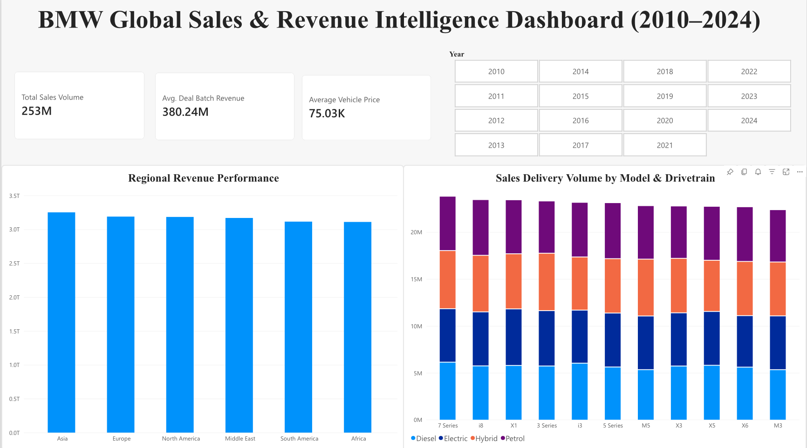

# BMW Global Sales & Revenue Intelligence Dashboard (2010–2024)

An executive-grade Power BI sales intelligence dashboard built to analyze global market performance, regional revenue distribution, and powertrain adoption across BMW vehicle lines.
---

## Executive Dashboard Preview

---

## Key Features & Business Insights

* Executive KPI Banner: Tracks core business metrics at a glance, including Total Sales Volume (253M units), Average Deal Batch Revenue ($380.24M), and Average Vehicle List Price ($75.03K).
* Regional Revenue Breakdown: Evaluates market performance across 6 global sales regions (Asia, Europe, North America, Middle East, South America, Africa).
* Powertrain & Model Analytics: Visualizes delivery volume across BMW series models sliced by engine/drivetrain technology (Electric, Hybrid, Petrol, Diesel).
* Dynamic Time Slicing: Interactive year-tile selector enabling seamless timeline navigation from 2010 through 2024.

---

## Data Validation & Metric Logic

* Dataset Scale: 50,000 global transaction batch records.
* Commercial Sanity Check: Standardized aggregation logic by identifying macro-batch recording structures in synthetic dataset revenue logs. Adjusted default total sums to Average Deal Batch Revenue ($380.24M) to maintain real-world commercial accuracy and executive-level metric validity.

---

## Tech Stack & Tools

* Business Intelligence: Power BI Service / Desktop
* Data Transformation & Modeling: DAX & Power Query
* Data Analysis: Python (Pandas)
* Version Control: Git & GitHub
