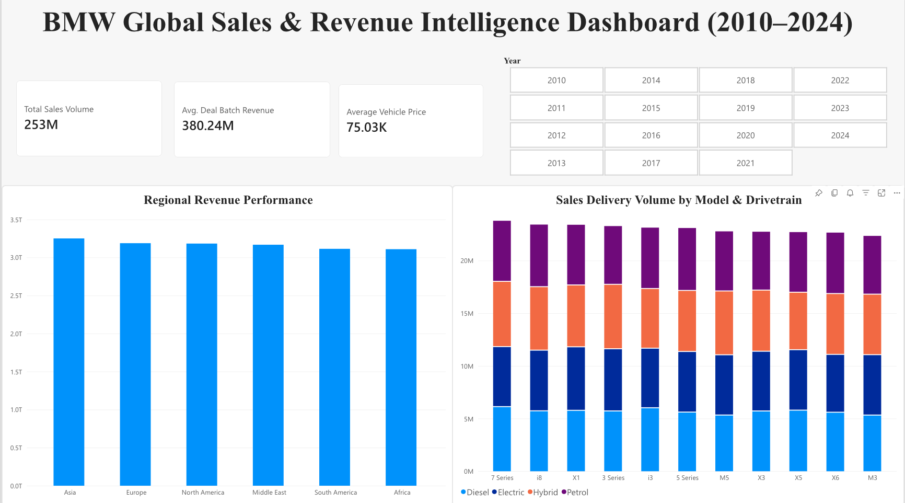

# BMW Global Sales & Revenue Intelligence Dashboard (2010-2024)

An interactive Power BI dashboard that gives a commercial team one view of global sales performance: revenue by region, volume by model, and powertrain mix over time. Built on a public dataset of 50,000 sales records covering 2010-2024.

## Business Questions Answered

| Question | Where to find it |
|---|---|
| Which regions drive revenue, and is it concentrated or evenly spread? | Regional Revenue Breakdown |
| Which models and series sell the most? | Model Analytics |
| How is the mix shifting between Petrol, Diesel, Hybrid and Electric? | Powertrain Analytics |
| How have volume and revenue trended year over year? | Year Slicer + KPI Banner |

## Dashboard Preview

## Key Findings

* **Revenue is evenly distributed across all 6 regions** (Asia, Europe, North America, Middle East, South America, Africa), with no single region dominating.
* **Volume is balanced across 11 models:** each model holds 8.8-9.4% of units, and the top 3 (7 Series, i8, X1) account for 27.9%.
* **Powertrain mix is stable from 2010 to 2024:** Diesel, Electric, Hybrid and Petrol each hold roughly a quarter of units, so Electric + Hybrid stays near 50% throughout.
* **Recommendation:** with no region, model or fuel type driving the portfolio, a sales team's growth levers are likely to be market-specific (pricing, targeting, product launches) rather than a rebalancing of the existing mix.
  
## Features

* **Executive KPI banner:** total sales volume, average deal batch revenue and average list price at a glance.
* **Regional revenue breakdown** across 6 sales regions.
* **Model and powertrain analytics:** delivery volume by BMW series, sliced by Electric, Hybrid, Petrol and Diesel.
* **Dynamic time slicing:** year selector covering 2010-2024.

## Data & Metric Definitions

**Source:** public BMW sales dataset **[link]**, 50,000 records, 2010-2024.

**Important data note:** each row is a *batch* of vehicles sold, not a single car, so summing the raw columns gives totals far above real-world BMW volumes. To keep the dashboard meaningful, headline metrics use averages per batch rather than raw sums.

| Metric | Definition |
|---|---|
| Total Sales Volume | Sum of units across all batch records **[confirm]** |
| Average Deal Batch Revenue | Total revenue divided by number of batch records ($380.24M) |
| Average Vehicle List Price | Mean list price per vehicle ($75.03K) |

**Cleaning steps (Python / Pandas):** **[e.g. checked for nulls and duplicates, standardized region and model names, validated year range]**.

## Data Model & Measures

* Power Query handles the load and type cleanup.
* DAX measures include **[list 3-5, e.g. Total Revenue, Avg Batch Revenue, YoY Growth %, Powertrain Share %]**.
* **[One line on the model structure, e.g. single fact table with a Date dimension]**.

## Tech Stack

* **BI:** Power BI Desktop / Service
* **Modeling:** DAX, Power Query
* **Data prep:** Python (Pandas)
* **Version control:** Git & GitHub

## Run It Locally

1. Clone the repository.
2. Open `[filename].pbix` in Power BI Desktop.
3. If prompted, point the data source to `data/[filename].csv`.

## Limitations & Next Steps

* The dataset is public and its batch structure means absolute volumes are not comparable to BMW's reported figures; the dashboard is for analysis practice, not financial reporting.
* Possible extensions: YoY growth and forecast views, a targets-vs-actuals page, row-level security by region.
